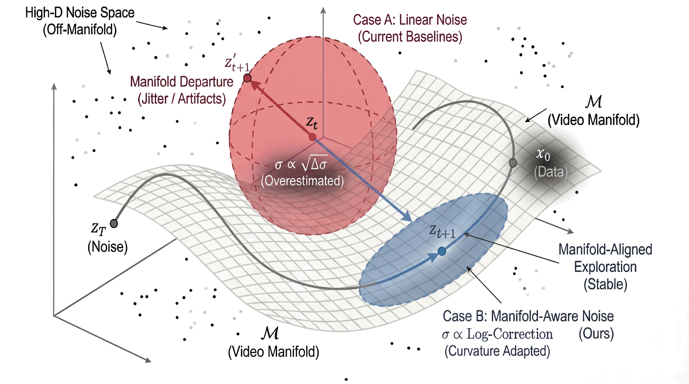

<div align=center>

</div>

<h5 align="center">Manifold-Aware Exploration for Reinforcement Learning in Video Generation</h5>

<div align="center">

[](https://arxiv.org/abs/2603.21872)
[](https://dungeonmassster.github.io/SAGE-GRPO-Page/)
[](https://pytorch.org/)
[](https://github.com/huggingface/transformers)
[](https://github.com/huggingface/diffusers)
[](./README_HYVideo.md)

</div>

<div align="center">

[Mingzhe Zheng](https://scholar.google.com/citations?user=U6bikksAAAAJ&hl=en)<sup>&ast;1,2</sup>,
[Weijie Kong](https://scholar.google.com/citations?hl=zh-CN&user=gsOklKAAAAAJ)<sup>&ast;2</sup>,
[Yue Wu](https://scholar.google.com/citations?user=1xTR6qoAAAAJ&hl=en)<sup>&Dagger;2</sup>,
[Dengyang Jiang](https://scholar.google.com/citations?user=tJcxeMoAAAAJ&hl=en)<sup>1</sup>,
[Yue Ma](https://scholar.google.com/citations?user=kwBR1ygAAAAJ&hl=zh-CN)<sup>1</sup>,
[Xuanhua He](https://scholar.google.com/citations?user=-bDAN2YAAAAJ)<sup>1</sup>,
[Bin Lin](https://scholar.google.com/citations?user=GCOVDKoAAAAJ&hl=zh-CN)<sup>2</sup>,
[Kaixiong Gong](https://scholar.google.com/citations?user=kBVshUUAAAAJ&hl=zh-CN)<sup>2</sup>,
[Zhao Zhong](https://scholar.google.com/citations?user=igtXP_kAAAAJ&hl=en)<sup>2</sup>,
[Liefeng Bo](https://scholar.google.com/citations?user=FJwtMf0AAAAJ&hl=en)<sup>2</sup>,
[Qifeng Chen](https://scholar.google.com/citations?user=lLMX9hcAAAAJ&hl=en)<sup>&dagger;1</sup>,
[Harry Yang](https://scholar.google.com/citations?hl=en&user=jpIFgToAAAAJ&view_op=list_works)<sup>&dagger;1</sup>

<sup>1</sup>HKUST &nbsp; <sup>2</sup>Tencent Hunyuan  
<sup>&ast;</sup>Equal contribution &nbsp; <sup>&dagger;</sup>Corresponding Authors &nbsp; <sup>&Dagger;</sup>Project Leader  
Work done during internship at Tencent Hunyuan

</div>

<div align="center">
SAGE-GRPO is an open-source post-training framework for aligning video generation models via GRPO, built on top of HunyuanVideo-1.5. It features a precise manifold-aware SDE for exploration, dual trust-region KL regularization, gradient norm equalization, and scalable multi-node multi-GPU training with sequence parallelism and FSDP.
</div>

<br>

<p align="center">

</p>

<p align="center"><b>Figure 1. Illustration of SAGE-GRPO.</b> <b>(Left)</b> (a.1) At higher noise regions, Euler-style discretization introduces extra energy (discretization error) beyond the true integral. (a.2) Our precise SDE removes unnecessary noise energy in high-noise regions, enabling more precise exploration and a better-learned data manifold. <b>(Right)</b> (b) Our method with improved exploration yields more stable and better-aligned generations compared with DanceGRPO, FlowGRPO, and CPS.</p>

## Highlights

We formulate GRPO for video generation as a **manifold-constrained exploration** problem:

<p align="center">

</p>

<p align="center"><b>Figure 2. Geometric interpretation of noise injection strategies.</b> Conventional linear SDEs (red) inject exploration noise using first-order approximations, causing off-manifold drift and temporal jitter. Our Manifold-Aware SDE (blue) uses a logarithmic correction term so that exploration noise stays close to the flow trajectory and the video manifold.</p>

- **Core Problem:** We show that the ODE-to-SDE conversions used in existing video GRPO methods can inject excess noise in high-noise steps, which reduces rollout quality and makes reward-guided updates less reliable.
- **Micro-level:** We constrain exploration with a *Precise Manifold-Aware SDE* and a *Gradient Norm Equalizer*, so that sampling noise stays manifold-consistent and updates are balanced across timesteps.
- **Macro-level:** We constrain long-horizon exploration with a *Dual Trust Region* using moving anchors and step-wise constraints, so that the trust region tracks more manifold-consistent checkpoints and prevents drift.

## Abstract

Group Relative Policy Optimization (GRPO) methods for video generation like FlowGRPO remain far less reliable than their counterparts for language models and images. This gap arises because video generation has a complex solution space, and the ODE-to-SDE conversion used for exploration can inject excess noise, lowering rollout quality and making reward estimates less reliable, which destabilizes post-training alignment.

To address this problem, we view the pre-trained model as defining a valid video data manifold and formulate the core problem as constraining exploration within the vicinity of this manifold, ensuring that rollout quality is preserved and reward estimates remain reliable.

We propose **SAGE-GRPO** (Stable Alignment via Exploration), which applies constraints at both micro and macro levels. At the micro level, we derive a *precise manifold-aware SDE* with a logarithmic curvature correction and introduce a *gradient norm equalizer* to stabilize sampling and updates across timesteps. At the macro level, we use a *dual trust region* with a periodic moving anchor and stepwise constraints so that the trust region tracks checkpoints that are closer to the manifold and limits long-horizon drift.

We evaluate SAGE-GRPO on HunyuanVideo-1.5 using VideoAlign as the reward model and observe consistent gains over previous methods in VQ, MQ, TA, and visual metrics (CLIPScore, PickScore), demonstrating superior performance in both reward maximization and overall video quality.

## Table of Contents

- [Highlights](#highlights)
- [Abstract](#abstract)
- [Installation](#installation)
- [Checkpoint Preparation](#checkpoint-preparation)
- [Post-Training](#post-training)
- [Key Training Parameters](#key-training-parameters)
- [Recommended 64-GPU Default](#recommended-64-gpu-default)
- [Visualization Gallery](#visualization-gallery)
- [Acknowledgements](#acknowledgements)
- [License](#license)
- [Citation](#citation)

## Installation

### 1. Clone the repository

```bash
git clone <your-fork-or-public-url>
cd SAGE-GRPO
```

### 2. Install Python dependencies

```bash
pip install -r requirements.txt
```

### 3. Download the reward model helper

```bash
bash download_weights.sh
```

### 4. Download the remaining HunyuanVideo checkpoints

After `download_weights.sh`, follow `checkpoints-download.md` to download the remaining base model, text encoder, and vision encoder weights. 

## Checkpoint Preparation

SAGE-GRPO expects both the HunyuanVideo-1.5 base checkpoints and the VideoReward reward model to be available under `./ckpts`.

Useful references:
- Base model documentation: `README_HYVideo.md`
- Detailed checkpoint download instructions: `checkpoints-download.md`
- Reward checkpoint helper: `download_weights.sh`

### Expected Checkpoint Layout

```text
ckpts/
├── assets
├── config.json
├── LICENSE
├── NOTICE
├── README.md
├── README_CN.md
├── scheduler
├── text_encoder
│   ├── byt5-small
│   ├── Glyph-SDXL-v2
│   └── llm
├── transformer
├── upsampler
├── vae
├── VideoReward
│   ├── checkpoint-11352
│   ├── model_config.json
│   └── README.md
└── vision_encoder
    └── siglip
```

If your local structure differs substantially from the above, training usually fails during model or reward initialization.

## Post-Training

### Hardware Recommendation

| Requirement | Recommended |
| --- | --- |
| GPU memory | 80 GB per GPU |
| GPU count | 64 GPUs (8 nodes x 8) |
| OS | Linux |
| PyTorch | 2.6+ |

### Single-node multi-GPU

For a single machine with 8 GPUs:

```bash
bash run_post_train.sh
```

This launches `post_train.py` with the default GRPO configuration via `torchrun --nproc_per_node=8`.

### Multi-node multi-GPU

For multi-node training:

```bash
bash run_post_train_multinode.sh
```

The multi-node entry internally calls:

```bash
bash scripts/post_train/pdsh_train.sh "scripts/post_train/train_grpo.sh"
```

Edit or export the node list and rendezvous-related environment expected by your cluster launcher before starting.


## Key Training Parameters

### Distributed Training

The three most important distributed-training knobs are `sp_size`, `batch_size`, and `num_generations`.

```text
dp_degree = world_size / sp_size
```

There is a validity constraint:

```text
(batch_size * dp_degree) % num_generations == 0
```

| Parameter | Default | Description |
| --- | --- | --- |
| `sp_size` | 8 | Sequence parallel degree. Must evenly divide `world_size`. |
| `batch_size` | 2 | Per-rank video micro-batch size. |
| `num_generations` | 4 | Number of rollout samples per prompt in GRPO group. |
| `learning_rate` | 1e-5 | Learning rate. |
| `max_steps` | 10000 | Maximum training steps. |

### SAGE-GRPO Method Parameters

These are the core parameters that distinguish SAGE-GRPO from other video GRPO methods:

**Exploration (Micro-level)**

| Parameter | Default | Description |
| --- | --- | --- |
| `sde_type` | `sage_grpo` | SDE type for GRPO rollout. Choices: `sage_grpo`, `dance_grpo`, `flow_grpo`, `cps`. |
| `use_grad_balancing` | `True` | Enable gradient norm equalizer across timesteps. |
| `enable_timestep_permutation` | `True` | Enable timestep permutation for training. |

**Trust Region (Macro-level)**

| Parameter | Default | Description |
| --- | --- | --- |
| `kl_weight` | 1e-5 | KL regularization weight. |
| `kl_coef` | 1e-7 | Initial KL coefficient. |
| `kl_min_coef` | 1e-7 | Lower bound for adaptive KL coefficient. |
| `use_moving_KL` | `True` | Enable periodic ref-model update (moving anchor). |
| `update_ref_model_step` | 10 | Ref-model update interval (optimizer update steps). |
| `use_dual_kl` | `True` | Enable dual KL: moving/fixed + step-wise constraints. |
| `dual_kl_moving_weight` | 1.0 | Weight for moving/fixed KL term. |
| `dual_kl_step_weight` | 0.1 | Weight for step-wise KL term. |

**Reward & Validation**

| Parameter | Default | Description |
| --- | --- | --- |
| `validate_at_step0` | `False` | Run sample validation at step 0. |
| `validate_video_length` | 81 | Number of frames for validation videos. |
| `validation_timestep_shift` | 5.0 | Timestep shift for validation sampling. |
| `reference_mode_offload` | `False` | Offload KL reference model to CPU when not in use. |

## Recommended 64-GPU Default

The default recommended large-scale setting:

```text
world_size = 64     sp_size = 2     batch_size = 2     num_generations = 4
```

From this:

```text
dp_degree           = 64 / 2              = 32
global_video_batch  = 2 * 32              = 64
num_prompt_groups   = 64 / 4              = 16
```

- **32** effective data-parallel replicas
- **64** rollout videos per GRPO sampling round
- **16** prompts grouped globally when `num_generations=4`

### Default single-node entry

The current single-node helper (`run_post_train.sh`) uses:

```bash
torchrun --nproc_per_node=8 post_train.py \
  --pretrained_model_root ./ckpts \
  --learning_rate 1e-5 \
  --batch_size 2 \
  --num_generations 4 \
  --max_steps 10000 \
  --output_dir ./outputs \
  --enable_fsdp \
  --enable_gradient_checkpointing \
  --sp_size 2 \
  --sde_type "sage_grpo" \
  --use_grad_balancing True \
  --enable_timestep_permutation True \
  --kl_weight 1e-5 \
  --kl_coef 1e-7 \
  --use_moving_KL True \
  --update_ref_model_step 10 \
  --use_dual_kl True \
  --dual_kl_moving_weight 1.0 \
  --dual_kl_step_weight 0.1 \
  --reference_mode_offload True
```

### Practical notes
- `sp_size=2` is the recommended starting point. The default in argparse is 8 but the launch script overrides it to 2.
- `batch_size=2` and `num_generations=4` are the default GRPO-friendly settings.
- If you scale down GPU count, re-check `dp_degree` and the divisibility constraint before launching.
- `reference_mode_offload` is helpful when KL reference model memory becomes a bottleneck.

## Visualization Gallery

All visual results are under `assets/Visual_Results/`.  
For a cleaner and fully curated presentation, please visit the project webpage: [SAGE-GRPO Webpage](https://dungeonmassster.github.io/SAGE-GRPO-Page/).

<details>
<summary><b>Click to expand visualization results</b></summary>

### 1. Compare with Baseline

<table>
<tr>
<th width="80">Case</th>
<th>HunyuanVideo-1.5 (Baseline)</th>
<th>SAGE-GRPO (Ours)</th>
</tr>
<tr>
<td>Case 1</td>
<td><video src="./assets/Visual_Results/Compare_with_Baseline/case1_baseline.mp4" width="320" controls></video></td>
<td><video src="./assets/Visual_Results/Compare_with_Baseline/case1_ours_full.mp4" width="320" controls></video></td>
</tr>
<tr>
<td colspan="3"><b>Prompt:</b> The scene opens on a medium, low-angle shot of a teenage boy on an empty, red-surfaced running track during sunset. He is positioned on the right third of the frame, having just completed an intense sprint. He wears a striking neon green athletic jacket, unzipped to reveal a dark shirt underneath, and black running shorts. His body is bent sharply at the waist, his hands pressed firmly onto his knees for support as he struggles to recover. His dark, curly hair is damp with sweat, which also beads on his forehead and temples. His chest rises and falls rapidly and deeply, and with each ragged exhalation, a faint mist of his breath is visible in the cooling air, illuminated by the strong backlight from the setting sun. The sun, low on the horizon, casts long shadows and bathes the scene in a warm, orange glow, creating a cinematic lens flare that streaks across the frame. After a few moments of labored breathing, he slowly and painfully straightens his posture, his eyes remaining fixed on the track ahead with a look of fierce determination mixed with utter exhaustion.</td>
</tr>
<tr>
<td>Case 2</td>
<td><video src="./assets/Visual_Results/Compare_with_Baseline/case2_baseline.mp4" width="320" controls></video></td>
<td><video src="./assets/Visual_Results/Compare_with_Baseline/case2_ours_full.mp4" width="320" controls></video></td>
</tr>
<tr>
<td colspan="3"><b>Prompt:</b> The scene opens on a tranquil, sun-drenched meadow in the late afternoon. An eye-level full shot frames Isaac Newton, a man with long hair dressed in simple 17th-century clothing, sitting at the base of a large, gnarled apple tree. He leans against the trunk, positioned according to the rule of thirds, creating a sense of balance and space. Dappled sunlight streams through the leafy canopy, casting soft, moving shadows on the ground. Newton is completely absorbed in thought, his gaze distant and unfocused. A gentle breeze rustles the leaves. High above him, a ripe red apple loosens from its stem. It drops silently at first, then lands with a distinct 'thump' on top of Newton's head. He flinches, startled out of his deep thoughts, and instinctively raises a hand to the point of impact. His eyes dart upwards towards the branches, then scan the ground around him. He spots the offending red apple lying in the grass. His initial annoyance gives way to curiosity as he reaches down, picks it up, and holds it in his palm. He turns it over, examining it, and his expression slowly transforms into one of profound, dawning realization, the genesis of a revolutionary idea.</td>
</tr>
<tr>
<td>Case 3</td>
<td><video src="./assets/Visual_Results/Compare_with_Baseline/case3_baseline.mp4" width="320" controls></video></td>
<td><video src="./assets/Visual_Results/Compare_with_Baseline/case3_ours_full.mp4" width="320" controls></video></td>
</tr>
<tr>
<td colspan="3"><b>Prompt:</b> The scene opens with a stunning wide shot, filmed in slow motion from a low angle. Five children, a diverse group of boys and girls aged between six and ten, are running exuberantly across a vast field. The field is filled with tall, golden-yellow grass that sways gently in the breeze and reaches their waists. It's the golden hour, and the setting sun, positioned behind the children, creates a brilliant backlight. This light forms a radiant halo around their hair and outlines their bodies, separating them from the lush background. Dust motes and pollen kicked up by their running feet dance and sparkle in the sunbeams. The children are spread out, yet moving together as a group from right to left across the frame. Their faces are alight with pure joy; mouths are open in laughter, and their eyes are bright with excitement. One girl with long blonde pigtails leads the pack, looking back over her shoulder with a wide grin. A boy in a red t-shirt leaps playfully into the air. The slow-motion effect accentuates every detail: the bounce of their hair, the flowing fabric of their clothes, and the effortless grace of their youthful movements. The sky above is a soft, clear blue, providing a cool contrast to the warm tones of the field below. The atmosphere is overwhelmingly joyful, nostalgic, and evocative of the perfect, endless days of summer childhood.</td>
</tr>
</table>

### 2. Compare with Other Methods (20 steps)

<table>
<tr>
<th width="80">Case</th>
<th>DanceGRPO</th>
<th>FlowGRPO</th>
<th>CPS</th>
<th>Ours</th>
</tr>
<tr>
<td>Showcase 1</td>
<td><video src="./assets/Visual_Results/Compare_with_Other_methods_20steps/showcase1_dancegrpo.mp4" width="200" controls></video></td>
<td><video src="./assets/Visual_Results/Compare_with_Other_methods_20steps/showcase1_flowgrpo.mp4" width="200" controls></video></td>
<td><video src="./assets/Visual_Results/Compare_with_Other_methods_20steps/showcase1_cps.mp4" width="200" controls></video></td>
<td><video src="./assets/Visual_Results/Compare_with_Other_methods_20steps/showcase1_ours.mp4" width="200" controls></video></td>
</tr>
<tr>
<td>Showcase 2</td>
<td><video src="./assets/Visual_Results/Compare_with_Other_methods_20steps/showcase2_dancegrpo.mp4" width="200" controls></video></td>
<td><video src="./assets/Visual_Results/Compare_with_Other_methods_20steps/showcase2_flowgrpo.mp4" width="200" controls></video></td>
<td><video src="./assets/Visual_Results/Compare_with_Other_methods_20steps/showcase2_cps.mp4" width="200" controls></video></td>
<td><video src="./assets/Visual_Results/Compare_with_Other_methods_20steps/showcase2_ours.mp4" width="200" controls></video></td>
</tr>
<tr>
<td>Showcase 3</td>
<td><video src="./assets/Visual_Results/Compare_with_Other_methods_20steps/showcase3_dancegrpo.mp4" width="200" controls></video></td>
<td><video src="./assets/Visual_Results/Compare_with_Other_methods_20steps/showcase3_flowgrpo.mp4" width="200" controls></video></td>
<td><video src="./assets/Visual_Results/Compare_with_Other_methods_20steps/showcase3_cps.mp4" width="200" controls></video></td>
<td><video src="./assets/Visual_Results/Compare_with_Other_methods_20steps/showcase3_ours.mp4" width="200" controls></video></td>
</tr>
<tr>
<td>Showcase 4</td>
<td><video src="./assets/Visual_Results/Compare_with_Other_methods_20steps/showcase4_dancegrpo.mp4" width="200" controls></video></td>
<td><video src="./assets/Visual_Results/Compare_with_Other_methods_20steps/showcase4_flowgrpo.mp4" width="200" controls></video></td>
<td><video src="./assets/Visual_Results/Compare_with_Other_methods_20steps/showcase4_cps.mp4" width="200" controls></video></td>
<td><video src="./assets/Visual_Results/Compare_with_Other_methods_20steps/showcase4_ours.mp4" width="200" controls></video></td>
</tr>
</table>

### 3. Compare with Other Methods (40 steps)

<table>
<tr>
<th width="80">Case</th>
<th>DanceGRPO</th>
<th>FlowGRPO</th>
<th>CPS</th>
<th>Ours</th>
</tr>
<tr>
<td>Case 1</td>
<td><video src="./assets/Visual_Results/Compare_with_Other_methods_40steps/case1_dancegrpo.mp4" width="200" controls></video></td>
<td><video src="./assets/Visual_Results/Compare_with_Other_methods_40steps/case1_flowgrpo.mp4" width="200" controls></video></td>
<td><video src="./assets/Visual_Results/Compare_with_Other_methods_40steps/case1_cps.mp4" width="200" controls></video></td>
<td><video src="./assets/Visual_Results/Compare_with_Other_methods_40steps/case1_ours.mp4" width="200" controls></video></td>
</tr>
<tr>
<td>Case 2</td>
<td><video src="./assets/Visual_Results/Compare_with_Other_methods_40steps/case2_dancegrpo.mp4" width="200" controls></video></td>
<td><video src="./assets/Visual_Results/Compare_with_Other_methods_40steps/case2_flowgrpo.mp4" width="200" controls></video></td>
<td><video src="./assets/Visual_Results/Compare_with_Other_methods_40steps/case2_cps.mp4" width="200" controls></video></td>
<td><video src="./assets/Visual_Results/Compare_with_Other_methods_40steps/case2_ours.mp4" width="200" controls></video></td>
</tr>
</table>

### 4. KL Ablation

<table>
<tr>
<th width="60">Case</th>
<th>No KL</th>
<th>Standard KL</th>
<th>Moving KL</th>
<th>Dual Moving KL</th>
<th>Stepwise</th>
</tr>
<tr>
<td>Case 1</td>
<td><video src="./assets/Visual_Results/KL_Ablation/case1_no_kl.mp4" width="160" controls></video></td>
<td><video src="./assets/Visual_Results/KL_Ablation/case1_std_kl.mp4" width="160" controls></video></td>
<td><video src="./assets/Visual_Results/KL_Ablation/case1_moving_kl.mp4" width="160" controls></video></td>
<td><video src="./assets/Visual_Results/KL_Ablation/case1_dual_mov_kl.mp4" width="160" controls></video></td>
<td><video src="./assets/Visual_Results/KL_Ablation/case1_stepwise.mp4" width="160" controls></video></td>
</tr>
<tr>
<td>Case 2</td>
<td><video src="./assets/Visual_Results/KL_Ablation/case2_no_kl.mp4" width="160" controls></video></td>
<td><video src="./assets/Visual_Results/KL_Ablation/case2_std_kl.mp4" width="160" controls></video></td>
<td><video src="./assets/Visual_Results/KL_Ablation/case2_moving_kl.mp4" width="160" controls></video></td>
<td><video src="./assets/Visual_Results/KL_Ablation/case2_dual_mov_kl.mp4" width="160" controls></video></td>
<td><video src="./assets/Visual_Results/KL_Ablation/case2_stepwise.mp4" width="160" controls></video></td>
</tr>
<tr>
<td>Case 3</td>
<td><video src="./assets/Visual_Results/KL_Ablation/case3_no_kl.mp4" width="160" controls></video></td>
<td><video src="./assets/Visual_Results/KL_Ablation/case3_std_kl.mp4" width="160" controls></video></td>
<td><video src="./assets/Visual_Results/KL_Ablation/case3_moving_kl.mp4" width="160" controls></video></td>
<td><video src="./assets/Visual_Results/KL_Ablation/case3_dual_mov_kl.mp4" width="160" controls></video></td>
<td><video src="./assets/Visual_Results/KL_Ablation/case3_stepwise.mp4" width="160" controls></video></td>
</tr>
<tr>
<td>Case 4</td>
<td><video src="./assets/Visual_Results/KL_Ablation/case4_no_kl.mp4" width="160" controls></video></td>
<td><video src="./assets/Visual_Results/KL_Ablation/case4_std_kl.mp4" width="160" controls></video></td>
<td><video src="./assets/Visual_Results/KL_Ablation/case4_moving_kl.mp4" width="160" controls></video></td>
<td><video src="./assets/Visual_Results/KL_Ablation/case4_dual_mov_kl.mp4" width="160" controls></video></td>
<td><video src="./assets/Visual_Results/KL_Ablation/case4_stepwise.mp4" width="160" controls></video></td>
</tr>
</table>

</details>

## Acknowledgements

- Base model and inference/training foundation: [HunyuanVideo-1.5](https://github.com/Tencent-Hunyuan/HunyuanVideo)
- Reward model: [VideoReward](https://github.com/KwaiVGI/VideoReward)
- Baseline algorithms: [FlowGRPO](https://github.com/yifan123/flow_grpo), [DanceGRPO](https://github.com/XueZeyue/DanceGRPO), [CPS](https://github.com/IamCreateAI/FlowCPS.git)

## Citation

If you find our work useful, please consider citing:

```bibtex
@article{zheng2026sagegrpo,
  title={Manifold-Aware Exploration for Reinforcement Learning in Video Generation},
  author={Zheng, Mingzhe and Kong, Weijie and Wu, Yue and Jiang, Dengyang and Ma, Yue and He, Xuanhua and Lin, Bin and Gong, Kaixiong and Zhong, Zhao and Bo, Liefeng and Chen, Qifeng and Yang, Harry},
  journal={arXiv preprint arXiv:2603.21872},
  year={2026}
}
```
